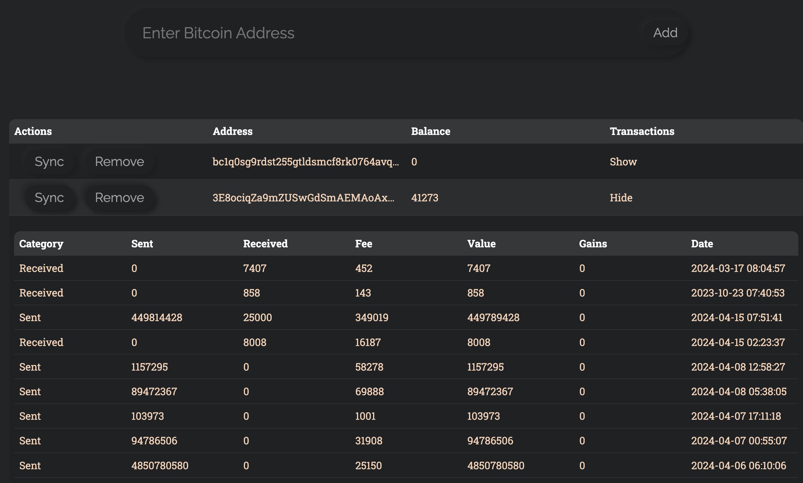
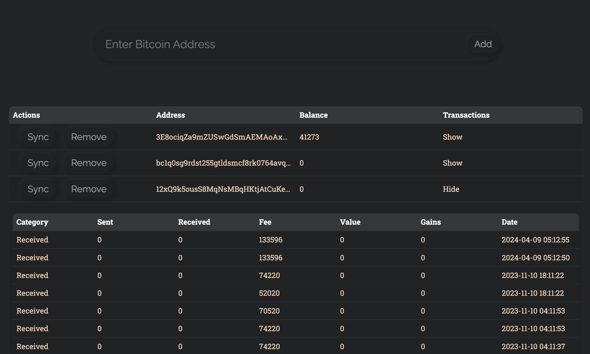

# Bitcoin Tracker 

Bitcoin Tracker is a simple application that tracks your Bitcoin wallets, similar to Cointracker. The application consists of a backend server and a frontend user interface.






## Structure

- `server/`: Contains the backend server code, written in Python using Flask
- `src/`: Contains the frontend code, written in JavaScript using React

### Front End

The web app allows you to add, remove, sync Bitcoin addresses to your wallet. 

### API Endpoints

The server provides the following API endpoints:

- `POST /addresses`: Add a new Bitcoin address to track. The body of the request should be a JSON object with a single property `address` that contains the Bitcoin address.

- `POST /addresses/<address>/sync`: Synchronize the transactions of the Bitcoin address specified in the URL. This will fetch the latest transactions from the blockchain and update the stored data.

- `GET /addresses`: Get a list of all added Bitcoin addresses and their transactions. This is not per user currently. The response is a JSON array (see data model in server.py)

- `DELETE /addresses/<address>`: Remove the Bitcoin address specified in the URL from the tracked addresses.

Note: the data is currently stored in memory. 

## Running the Application

### Dependencies for Server

- Python 3.8+
- Flask 1.1.2+
- Flask-CORS 3.0.10+
- requests 2

You can install these dependencies using pip:

```bash
pip install flask flask-cors requests
```

### Dependencies for Front-End

Please install node.js (https://nodejs.org/en)

To run the server, run
```
python server.py
```
The server will start on http://127.0.0.1:5000.

To run the frontend, run:
```
npm install (the first time)
npm start
```

You can use these Bitcoin addresses to play with the frontend:
```
3E8ociqZa9mZUSwGdSmAEMAoAxBK3FNDcd
bc1q0sg9rdst255gtldsmcf8rk0764avqy2h2ksqs5
bc1qm34lsc65zpw79lxes69zkqmk6ee3ewf0j77s3h 
```


## Future Improvements
### Features
- Implement logic to calculate gains in each transaction
- Improve the user interface for adding and managing wallets
- See more than 10 transactions (add pagination)
- Add support for other crypto currencies
- Add user authentication

### Tech Debt
- Decompose the server.py file
- Store data into a db 
- Store data per user


